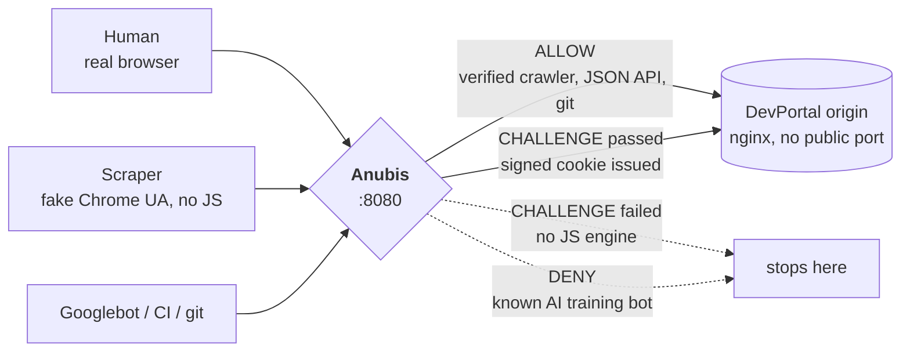
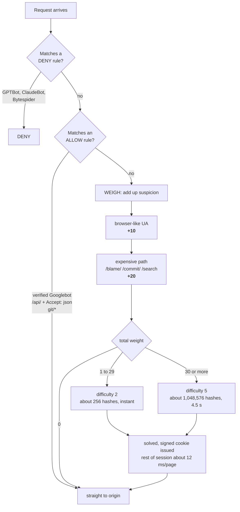

# Fighting AI scrapers with Anubis

**CSX4110 Project 02: Tech Update**
Warachai A. 6610996 · Badin B. 6611108 · Ratchanon P. 6610909

A runnable demo of [Anubis](https://github.com/TecharoHQ/anubis), an open-source
Web AI Firewall, protecting a stand-in developer portal.

---

## The problem

We run **DevPortal**: a Gitea code browser, an API docs wiki and an issue tracker.
Traffic grew about 5 times, but almost none of it is human. AI crawlers that do not
identify themselves read every *generated* page: every diff, every `blame`, every search
query. Those are our most expensive pages, because each hit runs git and database
queries with no cache.

They ignore `robots.txt`, use residential IP pools, and send normal browser User-Agent
strings, so rate limiting, IP blocking and User-Agent filters all fail.

## The idea

Anubis is a reverse proxy that makes every visitor pay a small cost. Suspicious clients
have to solve a SHA-256 proof-of-work puzzle in JavaScript before they reach our server.
If they solve it, they get a signed cookie and browse normally.

A human pays once, for a few seconds. A scraper pulling a million pages pays every time.
Scraping still works, it just gets expensive.

---

## Run it online (GitHub Codespaces)

[](https://codespaces.new/u6610909/anubis-demo)

1. Click the button above, then **Create codespace**. It installs Docker and starts the demo by itself. The first start takes a few minutes.
2. Open the **Ports** tab at the bottom, right-click port **8888**, and choose **Port Visibility → Public**.
3. Copy the link for port 8888 (it looks like `https://something-8888.app.github.dev`). Anyone can open it.

To run the terminal demo against the online copy:

```bash
BASE=https://something-8888.app.github.dev ./demo/demo.sh
```

The codespace goes to sleep after about 30 minutes with no activity. Start it again from the same button and the link stays the same.

## Quick start (on your own computer)

You need Docker Desktop running.

```bash
git clone https://github.com/u6610909/anubis-demo.git
cd anubis-demo
docker compose up -d
./demo/demo.sh
```

The first run downloads the Anubis and nginx images.

Then open <http://localhost:8888/blame/> in a private or incognito window and watch it solve the challenge. Use a new private window each time: once a browser passes, its cookie lasts 7 days and it will skip the challenge.

```bash
docker compose down
```

> Host port **8888** maps to Anubis's internal 8080. Change it in `docker-compose.yml`
> if that port is already in use. Nginx has no published port, so the origin cannot be
> reached except through the firewall. If you publish one, visitors can skip Anubis
> completely.

---

## Diagrams

### Architecture



### How a request is scored

Anubis gives each request a **weight**, then a threshold decides what happens to it.



---

## What the demo shows

| # | Client | Result | Why |
|---|--------|--------|-----|
| 1 | `GPTBot/1.2` | **DENIED** | matches `ai-block-aggressive.yaml` |
| 2 | curl pretending to be Chrome | **CHALLENGED**, difficulty 2 | looks like a browser, so weight 10. No JS engine, so it stops |
| 3 | same, on `/blame/` | **CHALLENGED**, difficulty 5 | +20 for the expensive path, so weight 30 |
| 4 | CI runner, `Accept: application/json` | **PASSED** | explicit ALLOW, because CI cannot run JS |
| 5 | `git/2.45.0` | **PASSED** | explicit ALLOW |
| 6 | real browser | **PASSED** in about 4.5 s, then about 12 ms/page | solved the puzzle and got the cookie |

### Measured on a 2026 MacBook (about 130 kH/s)

`difficulty` counts leading zeros in hex, not in bits, so each +1 means 16 times more work:

| difficulty | expected hashes | time |
|---|---|---|
| 2 | 256 | instant |
| 4 | 65,536 | about 0.5 s |
| **5** | **1,048,576** | **about 4.5 s** (our expensive tier) |
| 6 | 16,777,216 | over 2 min, measured and rejected as too slow |

Choosing this number is the main decision you have to make when deploying Anubis.

---

## Gotchas we hit

- **`USE_REMOTE_ADDRESS: "true"` is required** when Anubis is exposed directly. It
  normally sits behind Nginx or Caddy, which sets `X-Real-Ip`. Without it, every request
  returns HTTP 500 with *administrator has misconfigured Anubis*.
- **Challenges return HTTP 200, not 403.** This looks wrong, but aggressive scrapers
  keep retrying after a 4xx and stop once they get a 200.
- **Allow your own machine clients first.** Anything without a JavaScript engine, such
  as CI, mobile apps, `git` and feed readers, breaks unless you add an explicit ALLOW
  rule. This is the easiest way to take down your own service.
- **`ED25519_PRIVATE_KEY_HEX` is a secret.** It signs the cookie. Ours is written into
  the compose file for the demo. In production, generate one with `openssl rand -hex 32`.
- The GeoIP and ASN rules in the upstream default policy need a paid
  [Thoth](https://anubis.techaro.lol/docs/admin/thoth) subscription, so we left them out.

## Limitations

- **It slows scrapers down, it does not stop them.** A well funded scraper can run
  headless Chrome and pay the cost. The goal is to make bulk scraping too expensive to
  be worth doing.
- **It needs JavaScript**, so text browsers and some accessibility tools cannot get through.
- **Proof of work uses the visitor's CPU and battery.** This is a real cost, and it is
  the main criticism the project gets.
- **Choosing the difficulty is a guess.** Too low does nothing, too high pushes users
  away. You can only find the right value by testing.

## Files

```
docker-compose.yml   # Anubis in front of nginx
botPolicies.yaml     # the rules, and the file worth reading
www/                 # the fake DevPortal site (home, /blame/, /commit/, /search/, /api/)
demo/demo.sh         # scripted demo: runs five kinds of client against Anubis
demo/watch-log.sh    # live, readable view of what Anubis decides (needs jq)
.devcontainer/        # setup for running the demo in GitHub Codespaces
```

## References

- Anubis: <https://github.com/TecharoHQ/anubis> (MIT), by Xe Iaso at Techaro
- Docs: <https://anubis.techaro.lol/docs/>
- Used in production by GNOME, SourceHut, the Linux kernel mailing list archives,
  FFmpeg and UNESCO.
