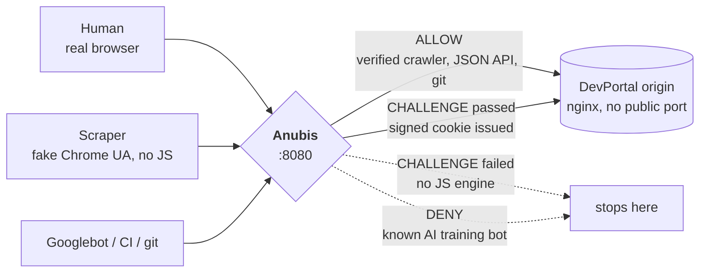
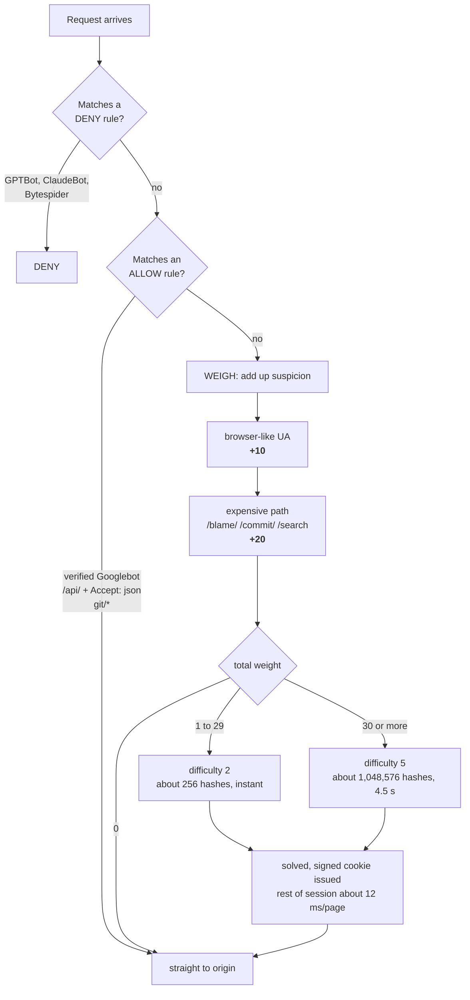

# Anubis demo (CSX4110 Project 02: Tech Update)

Warachai A. 6610996 · Badin B. 6611108 · Ratchanon P. 6610909

This is our demo for the Tech Update project. We put [Anubis](https://github.com/TecharoHQ/anubis),
an open-source Web AI Firewall, in front of a small fake website and show how it treats
different bots.

## How to run the demo

You need:

- Docker Desktop, and it has to be running
- git
- jq, but only for step 5 (on a Mac: `brew install jq`)

On Windows, `docker compose` works in PowerShell, but the `.sh` scripts need Git Bash or WSL.

### Step 1: Download and start it

```bash
git clone https://github.com/u6610909/anubis-demo.git
cd anubis-demo
docker compose up -d
```

The first time, Docker downloads the Anubis and nginx images, so it takes a minute or two.

### Step 2: Run the terminal demo

```bash
./demo/demo.sh
```

Press Enter to go to the next step. The script pretends to be five different visitors
using `curl`. You should see GPTBot get DENIED, a fake Chrome get a puzzle (difficulty 2),
the same fake Chrome get a harder puzzle on `/blame/` (difficulty 5), and our CI runner
and git get PASSED.

Use `./demo/demo.sh --fast` if you do not want to press Enter each time.

### Step 3: Try it in a real browser

Open a private or incognito window and go to <http://localhost:8888/blame/>.
You will see the Anubis page with a progress bar. After a few seconds you get the
DevPortal page. Reload it and it opens straight away, because your browser now has
the cookie.

Use a new private window every time you want to see the puzzle again. The cookie lasts
7 days, so a normal window will skip the puzzle.

### Step 4 (optional): Dress up your browser as GPTBot

In Chrome, open DevTools (`Cmd+Option+I`), press `Cmd+Shift+P` and type
`>network conditions`. Under User agent, untick "Use browser default", choose Custom,
and paste:

```
Mozilla/5.0 AppleWebKit/537.36 (KHTML, like Gecko); compatible; GPTBot/1.2; +https://openai.com/gptbot
```

Reload the page with DevTools still open. You get the "Oh noes!" page, because Anubis
now thinks you are GPTBot. Tick "Use browser default" again to go back to normal.

### Step 5 (optional): Watch what Anubis decides

Open a second terminal in the same folder and run:

```bash
./demo/watch-log.sh
```

Every time a bot is blocked or gets a puzzle, a line shows up, for example:

```
07:46:53  BLOCKED   GPTBot           /          rule: bot/ai-crawlers-training
07:46:53  PUZZLE    Chrome           /blame/    weight 30, hard puzzle (difficulty 5)
```

Visitors that are just let in (git, our API, plain curl) do not show up here. Press
`Ctrl+C` to stop it.

### Step 6 (optional): Send a lot of bots at once

```bash
./demo/flood.sh 1000 100
```

This sends 1000 requests from 8 kinds of bots, 100 at a time, and prints a table of
what happened to each. At the end it checks how many requests really reached the
website. That number should be the same as the number Anubis let in.

### Step 7: Stop it

```bash
docker compose down
```

### If something goes wrong

| Problem | What to do |
|---|---|
| `Cannot connect to the Docker daemon` | Docker Desktop is not running. Open it and wait. |
| `port is already allocated` | Something else uses port 8888. In `docker-compose.yml`, change `"8888:8080"` to something like `"8899:8080"` and use that port. |
| The browser skips the puzzle | It already has the cookie. Close all private windows and open a new one. |
| `demo.sh` says STOP, cannot reach the demo | The demo is not running. Run `docker compose up -d`. |

## The problem we are solving

Our story is that we run DevPortal: a Gitea code browser, an API docs wiki and an issue
tracker. Traffic grew about 5 times, but almost none of it is human. AI crawlers that
do not say who they are keep reading every generated page: every diff, every `blame`,
every search query. These are our most expensive pages, because each one runs git and
database queries with no cache.

The crawlers ignore `robots.txt`, use residential IP pools, and send normal browser
User-Agent strings. So rate limiting, IP blocking and User-Agent filters did not work.

## How Anubis helps

Anubis sits in front of the website as a reverse proxy. Visitors that look suspicious
have to solve a SHA-256 proof-of-work puzzle in JavaScript before they can see the
website. If they solve it, they get a signed cookie and can browse normally.

A person only pays once, for a few seconds. A scraper that wants a million pages has to
pay every time. Scraping still works, it just gets expensive.

In our setup, nginx has no port of its own, so you cannot reach the website without
going through Anubis. If you publish a port for nginx, visitors can skip Anubis.

## Diagrams

### Architecture



### How a request is scored

Anubis gives each request a weight (points). Then the total decides what happens.



## What the demo shows

| # | Visitor | Result | Why |
|---|--------|--------|-----|
| 1 | `GPTBot/1.2` | DENIED | it is in the `ai-block-aggressive.yaml` rule pack |
| 2 | curl pretending to be Chrome | puzzle, difficulty 2 | looks like a browser, so 10 points. curl cannot run JavaScript, so it stops here |
| 3 | the same, on `/blame/` | puzzle, difficulty 5 | +20 for the expensive page, so 30 points |
| 4 | CI runner with `Accept: application/json` | PASSED | our ALLOW rule, because CI cannot run JavaScript |
| 5 | `git/2.45.0` | PASSED | our ALLOW rule |
| 6 | real browser | PASSED after about 4.5 s, then about 12 ms per page | it solved the puzzle and got the cookie |

## Timings we measured

We measured these on a 2026 MacBook (about 130 kH/s). `difficulty` counts leading zeros
in hex, not in bits, so each +1 means 16 times more work.

| difficulty | expected hashes | time |
|---|---|---|
| 2 | 256 | instant |
| 4 | 65,536 | about 0.5 s |
| 5 | 1,048,576 | about 4.5 s (we use this for the expensive pages) |
| 6 | 16,777,216 | over 2 minutes, so we did not use it |

Picking this number is the main decision you have to make when you set up Anubis.

## Files

```
docker-compose.yml   # starts Anubis in front of nginx
botPolicies.yaml     # the rules (the most important file)
www/                 # the fake DevPortal website (home, /blame/, /commit/, /search/, /api/)
demo/demo.sh         # the terminal demo with five kinds of visitors
demo/watch-log.sh    # shows what Anubis decides, one line per visitor (needs jq)
demo/flood.sh        # sends many bots at once and counts the results
```

## References

- Anubis: <https://github.com/TecharoHQ/anubis> (MIT license), by Xe Iaso at Techaro
- Anubis docs: <https://anubis.techaro.lol/docs/>
- It is used by GNOME, SourceHut, the Linux kernel mailing list archives, FFmpeg and
  UNESCO.
